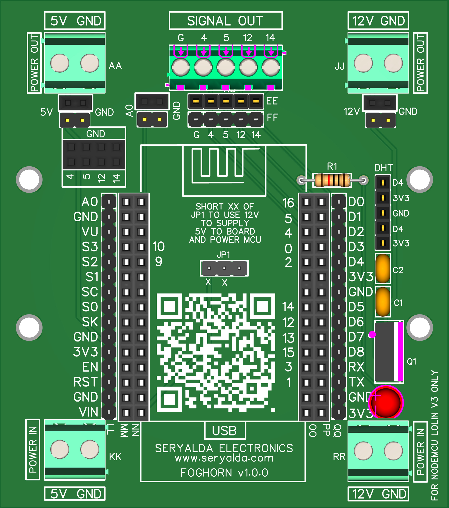

## Top
# FOGHORN Board Version History

### 🏡 [Home](https://github.com/seryalda)

## Overview

### ESP8266 NodeMCU v3 Expansion Board
FOGHORN is a board crafted for seamless integration with ESP8266 NodeMCU v3 modules. With dimensions of 76mm x 86mm, its installation is made simple with two screw holes. This board features female headers for DHT sensor integration and GPIO pin testing, providing an adaptable solution. Additionally, it allows for flexible power options, supporting 5VDC or 12VDC through terminal blocks.
📚 Check out the different board versions below:

## Version
<!--
- [🚀 Version 1.0.0](./1.0.0) : This is the initial board version that started it all!
-->

| Version | Board Image | Release Date  | Remarks   | Notes |
|--------------------|--------------------------------------------|-------------------------------------------------------------------------------------------------------|--------------------------------------------------------------------------------------------------------------------------------------------------|---------------|
| [1.0.0](./1.0.0) |  | NOV 2023 | NA | [🛍️ BUY THIS BOARD!](https://www.amazon.sa/dp/B0CMV94BPG/) |

[🔝 Top](#top)

## Changelog
- [📃 Logs and Releases](./changelog.md)

[🔝 Top](#top)
